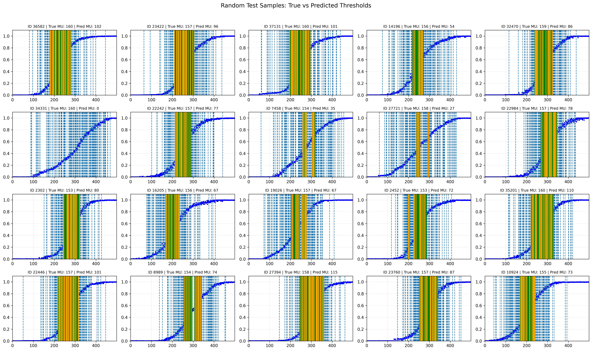

# MUNE - Motor Unit Threshold Prediction

Deep learning-based algorithm for predicting Motor Unit (MU) activation thresholds.

**Rehabilitation University · School of Rehabilitation Science and Engineering**

## Prediction Results Preview



*Figure: Ground truth thresholds (blue dashed lines) vs predicted thresholds (green/orange). Green indicates correct predictions, orange indicates false positives, and blue dashed lines indicate missed detections.*

## Quick Start

### Environment Setup

```bash
# Create virtual environment
python3 -m venv venv
source venv/bin/activate

# Install dependencies
pip install -r requirements.txt
```

### Data Preprocessing

```bash
# Process simulation data (supports percentage sampling)
cd data/SimDataset
python3 preprocess_sim.py --start_ratio 0.0 --end_ratio 1.0
```

### Train Model

```bash
# Basic training
python3 train.py --epochs 150

# Use weighted loss (recommended for imbalanced data)
python3 train.py --epochs 150 --use_weighted_loss True --pos_weight 50.0

# Adjust evaluation threshold
python3 train.py --epochs 150 --metrics_threshold 0.5
```

### Test Model

```bash
# Test with timestamp
python3 test.py --timestamp 20251023_214442

# Automatically use latest model
python3 test.py

# Adjust number of test samples
python3 test.py --timestamp 20251023_214442 --num_collect 50
```

### Generate Visualizations

```bash
# Use timestamp to automatically match train and test data
python3 plot/visualization.py --timestamp 20251023_214442

# Manually specify data files
python3 plot/visualization.py \
  --train_json plot/curve_data/train_xxx.json \
  --test_json plot/curve_data/test_xxx.json
```

### One-Click Pipeline

```bash
# Complete workflow: clean data → train → test → visualize → notify
python3 pipeline.py --epochs 150 --feishu_webhook "your_webhook_url"

# Don't clean old data
python3 pipeline.py --epochs 150 --clean False
```

## Project Structure

```
MUNE/
├── train.py              # Training script
├── test.py               # Testing script
├── pipeline.py           # Automated workflow
├── model.py              # Model definitions (Linear, CNN, LSTM)
├── dataset.py            # Dataset loader
├── loss.py               # Loss functions (CE, Focal, Threshold)
├── metrics.py            # Evaluation metrics
├── config.yaml           # Configuration file
├── data/
│   └── SimDataset/
│       ├── data.mat      # Raw data
│       ├── data.npz      # Preprocessed data
│       └── preprocess_sim.py
├── plot/
│   ├── visualization.py  # Visualization generation
│   ├── curve_data/       # Train/test data (JSON)
│   └── visual_res/       # Visualization charts
├── assets/               # README resources
└── checkpoints/          # Model checkpoints
```

## Main Parameters

### Training Parameters

| Parameter | Default | Description |
|-----------|---------|-------------|
| `--epochs` | 10 | Number of training epochs |
| `--batch_size` | 4 | Batch size |
| `--lr` | 1e-4 | Learning rate |
| `--model_type` | LSTM | Model type (Linear/CNN/LSTM) |
| `--loss_type` | ce | Loss function (ce/focal/thr) |
| `--use_weighted_loss` | True | Use weighted loss |
| `--pos_weight` | 7.0 | Positive sample weight |
| `--metrics_threshold` | 0.5 | Evaluation threshold |
| `--patience` | 5 | Early stopping patience |

### Testing Parameters

| Parameter | Default | Description |
|-----------|---------|-------------|
| `--timestamp` | None | Model timestamp (auto-use latest) |
| `--num_collect` | 20 | Number of test samples (0=all) |
| `--batch_size` | 4 | Batch size |
| `--metrics_threshold` | 0.5 | Evaluation threshold |
| `--save_samples` | True | Save sample data |

## Data Description

### Input Data
- **CMAP**: Compound Muscle Action Potential amplitude sequence `(batch, 500)`
- **Thresholds**: Motor unit activation threshold positions `(batch, 500)`

### Data Split
- Training set: 90% (0.0 - 0.9)
- Validation set: 5% (0.9 - 0.95)
- Test set: 5% (0.95 - 1.0)

### Data Characteristics
- Highly imbalanced: ~5% positive samples
- Sparse labels: Only a few threshold points among 500 positions

## Outputs

### Training Outputs
- **Model**: `checkpoints/best_model_{timestamp}.pth`
- **Training data**: `plot/curve_data/train_{timestamp}.json`

### Testing Outputs
- **Test data**: `plot/curve_data/test_{timestamp}.json`

### Visualization Outputs
- `loss_curves.png` - Train/validation loss curves
- `val_metrics_curves.png` - Validation metrics evolution
- `test_metrics_summary.png` - Test metrics summary
- `random_test_samples.png` - Sample prediction comparison

## Evaluation Metrics

- **Precision**: Prediction accuracy
- **Recall**: Recall rate
- **F1**: F1 score
- **IoU**: Intersection over Union
- **EMD**: Earth Mover's Distance (threshold-independent)
- **Score**: Composite score

## Performance Reference

### Training Time (per epoch)
- Dataset: 90,000 samples
- Batch size: 4
- Time: ~207 seconds (~3.5 minutes)

### Expected Results (150 epochs, pos_weight=50)
- Validation Recall: ~0.85-0.93
- Validation F1: ~0.13-0.15
- Test Recall: ~1.0

## FAQ

### Q: Why are all validation metrics 0?
**A**: When using `metrics_threshold=0.5`, model output probabilities are below threshold. Solutions:
- Use weighted loss: `--use_weighted_loss True --pos_weight 50.0`
- Or lower threshold: `--metrics_threshold 0.2`

### Q: How to speed up training?
**A**: 
- Increase batch_size: `--batch_size 8` or `--batch_size 16`
- Reduce data size: Modify sampling ratio in `preprocess_sim.py`
- Use faster model: `--model_type CNN`

### Q: How to check training progress?
**A**: 
```bash
# Check running processes
ps aux | grep train.py

# Check latest generated files
ls -lht checkpoints/ | head -5
ls -lht plot/curve_data/ | head -5
```

### Q: How to stop the pipeline?
**A**: 
```bash
# Stop all training processes
pkill -f "python.*train.py"

# Or use Ctrl+C (if running in foreground)
```

## Feishu Integration (Under Development)

Pipeline supports pushing results to Feishu (feature in development):

1. Add custom bot to Feishu group
2. Get Webhook URL
3. Run:
   ```bash
   python3 pipeline.py --epochs 150 --feishu_webhook "your_webhook_url"
   ```

*Note: Image upload functionality is currently under development.*

## License

MIT

## Contact

For issues, please submit an Issue.
